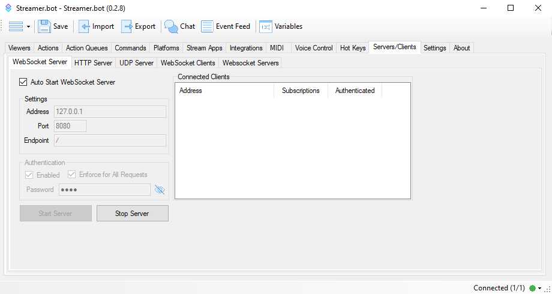
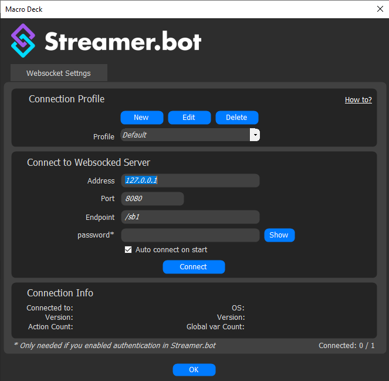
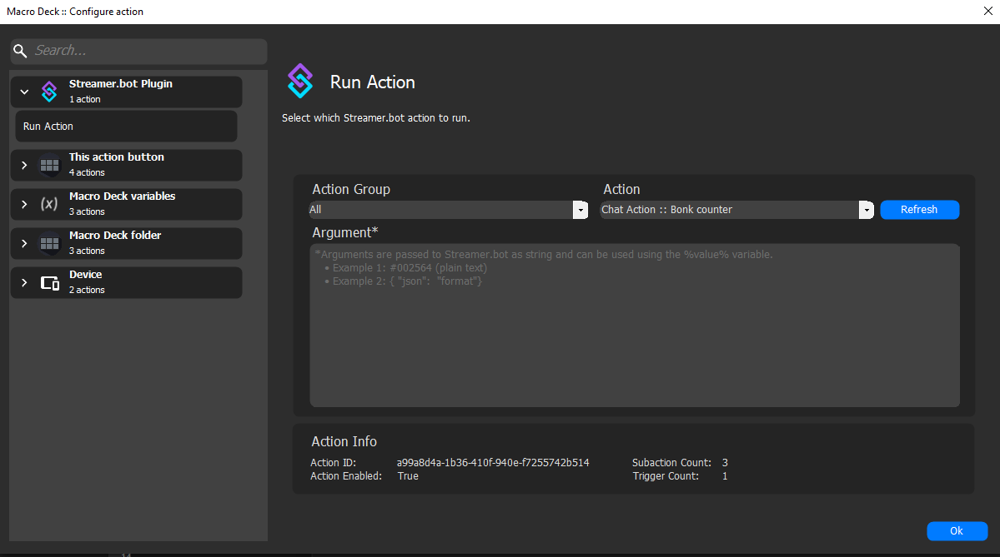
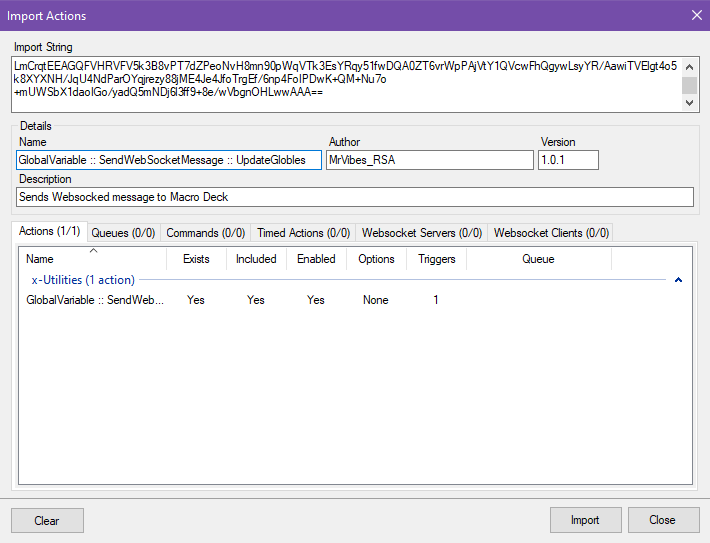
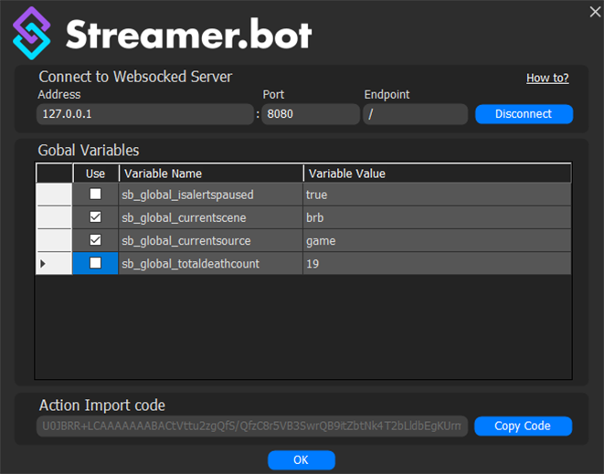
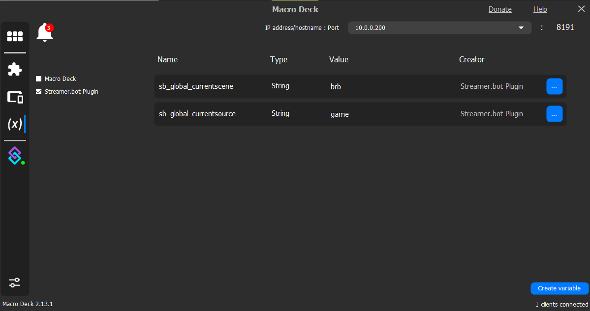

# Streamer.bot Plugin
Streamer.bot plugin for Macro Deck.

---

## Connecting Macro Deck to Streamer Bot WebSocket Server

To enhance your streaming experience, you can connect Macro Deck to a Streamer.bot WebSocket server. This allows you to control various aspects of your stream directly from your mobile device using Macro Deck's intuitive interface.

### Step 1: Obtain WebSocket Server Details

First, ensure you have the WebSocket server details provided by your Streamer.bot app. This typically includes the server address, port number, and endpoint.

### Step 2: Configure Macro Deck Streamer.bot Plugin

Open the Macro Deck app and navigate to the plugin section to open the configuration settings.

### Step 3: Enter Server Details

Enter the WebSocket server address, port number, and endpoint provided by your Streamer.bot app into the appropriate fields in Macro Deck Streamer.bot Plugin settings and click Connect. You will now be able to add Macro Deck buttons to run Streamer.bot actions.

---

## Using Streamer.bot Global Variables in Macro Deck

### Step 1: Getting Streamer.bot's Global Variable to Macro Deck

To do so, first, copy the Streamer.bot action code from the plugin config and paste it into the Streamer.bot import action section. You will now have an action that triggers every time a Global Variable updates.

### Step 2: Using Global Variables in Macro Deck

Once the Global Variable updates, the plugin will catch them in a data grid. If you would like to use the variables in Macro Deck, all you need to do is check them, and they will be available to Macro Deck.

---

### Useful Links
- [Streamer.bot](https://streamer.bot/)
- [Macro Deck](https://macrodeck.org/)

### Streamer.bot - Actions
A collection of MrVibes_RSA's Streamer.bot actions.

- [Ask Magic 8-ball](Magic-8-ball/README.md)
- [Improved Deathcounter](Improved-Deathcounter/README.md)
- [Shadows-Lurker](Shadows-Lurker/README.md)
- [Speed Run Timer](Speed-Run-Timer/README.md)
- [Twitch Clip to Discord](Clip-To-Discord/README.md)
