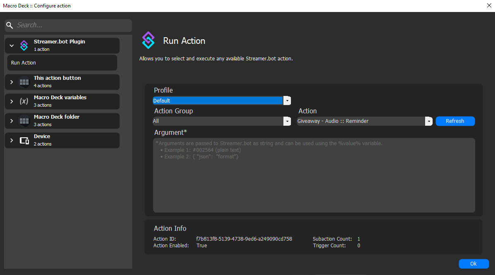

# Streamer.bot Plugin 

Streamer.bot plugin for Macro Deck.

Updated 29/04/2025 [Changelog](#changelog) 

---

## Connecting Macro Deck to Streamer Bot WebSocket Server

To enhance your streaming experience, you can connect Macro Deck to a Streamer.bot WebSocket server. This allows you to control various aspects of your stream directly from your mobile device using Macro Deck's intuitive interface.

### Step 1: Obtain WebSocket Server Details

First, ensure you have the WebSocket server details provided by your Streamer.bot app. This typically includes the server address, port number, and endpoint.

### Step 2: Configure Macro Deck Streamer.bot Plugin

Open the Macro Deck app and navigate to the plugin section to open the configuration settings.

### Step 3: Enter Server Details

Enter the WebSocket server address, port number, and endpoint provided by your Streamer.bot app into the appropriate fields in Macro Deck Streamer.bot Plugin settings and click Connect. You will now be able to add Macro Deck buttons to run Streamer.bot actions.

---

## Using Streamer.bot Global Variables in Macro Deck

---

## Changelog {#changelog}
- **Completely rebuilt the plugin** for easier maintenance and feature addition.
- **Moved from using WebSocketSharp** to `System.Net.WebSockets`.
- **Auto-connect on start** functionality added.
- **Improved error handling** throughout the plugin.
- **Better handling of global variables** — no extra steps required in Streamer.bot, and now subscribes to global variable updates.
- **Better connection info retrieval** when connecting to the WebSocket server.
- **Added authentication** support with Streamer.bot.
- **Rebuilt the “Connect to Server” UI**:
  - Added password field.
  - Added auto-connect on start checkbox.
- **Rebuilt the “Run Action” UI**:
  - Streamer.bot actions can now be filtered by action group.
  - Added search feature with autocomplete in the dropdown.
- **Expanded the argument field**:
  - Now supports default string and JSON.
  - Right-click options for "Format JSON" and "Validate JSON".
- **Displays more information** about the selected action.

---
### Useful Links
- [Streamer.bot](https://streamer.bot/)
- [Macro Deck](https://macrodeck.org/)

### Streamer.bot - Actions
A collection of MrVibes_RSA's Streamer.bot actions.

- [Ask Magic 8-ball](Magic-8-ball/README.md)
- [Improved Deathcounter](Improved-Deathcounter/README.md)
- [Shadows-Lurker](Shadows-Lurker/README.md)
- [Speed Run Timer](Speed-Run-Timer/README.md)
- [Twitch Clip to Discord](Clip-To-Discord/README.md)
